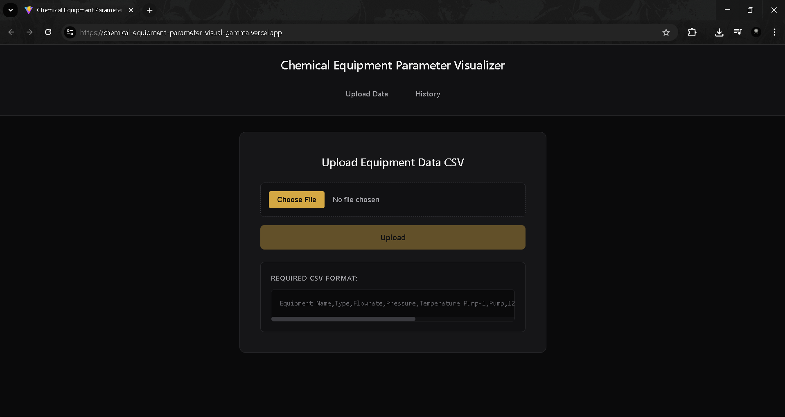
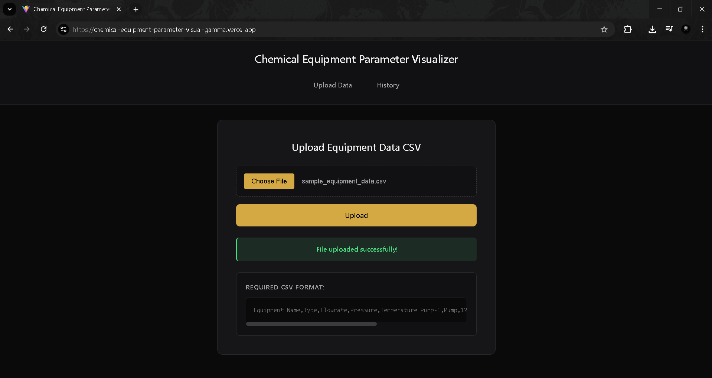
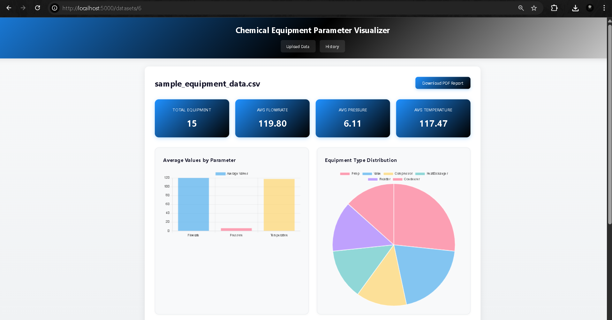
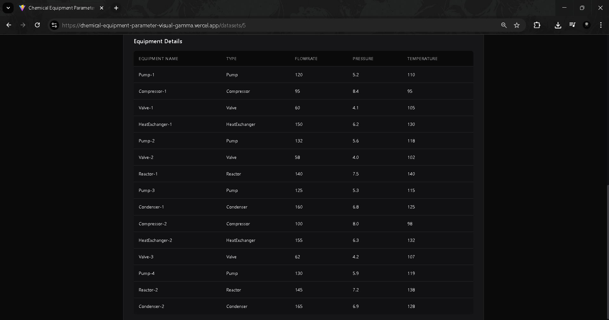
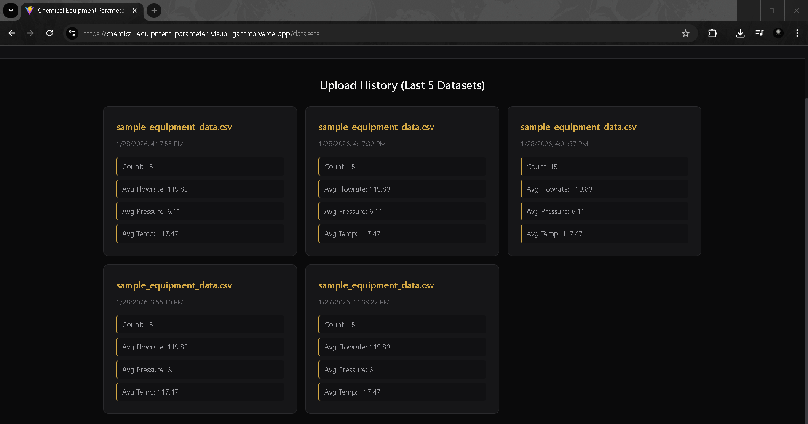
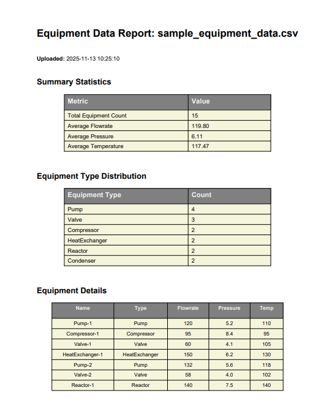

# Chemical Equipment Parameter Visualizer

A hybrid web and desktop application for visualizing and analyzing chemical equipment data. This application allows users to upload CSV files containing equipment parameters and provides comprehensive data visualization, statistics, and reporting capabilities.

## Project Overview

This project demonstrates a full-stack hybrid architecture:
- **Backend**: Django REST Framework API (Python)
- **Web Frontend**: React.js with Chart.js visualizations
- **Desktop Frontend**: PyQt5 with Matplotlib visualizations
- **Database**: SQLite for data persistence
- **Data Processing**: Pandas for analytics

Both the web and desktop applications consume the same Django REST API, ensuring consistent functionality across platforms.

## Screenshots

## Screenshots









## Video
<video src="Chemical_Equipment_Parameter_Visualizer.mp4" controls muted autoplay loop width="600"></video>


## Features

 **CSV File Upload** - Upload equipment data via web or desktop interface  
 **Data Validation** - Automatic validation of CSV format and required columns  
 **Statistical Analysis** - Calculate totals, averages, and distributions  
 **Interactive Charts** - Bar charts and pie charts for data visualization  
 **History Management** - Store and access last 5 uploaded datasets  
 **PDF Report Generation** - Download professional PDF reports with data summaries  
 **Basic Authentication** - Secure API with user authentication  
 **Responsive Design** - Beautiful, modern UI for web application  

## Tech Stack

### Backend
- Python 3.11
- Django 5.2.8
- Django REST Framework 3.16.1
- Pandas 2.3.3
- ReportLab 4.4.4
- SQLite Database

### Frontend (Web)
- React.js 18
- Vite (Build tool)
- Chart.js & React-Chart.js-2
- React Router DOM
- Axios

### Frontend (Desktop)
- PyQt5 5.15.10
- Matplotlib 3.8.2
- Requests

## Project Structure

```
.
├── backend/                # Django REST API
│   ├── equipment_api/      # Django project settings
│   ├── api/                # API app with models, views, serializers
│   ├── manage.py
│   └── db.sqlite3          # SQLite database
├── frontend/               # React web application
│   ├── src/
│   │   ├── components/     # React components
│   │   ├── services/       # API service layer
│   │   ├── App.jsx
│   │   └── main.jsx
│   ├── package.json
│   └── vite.config.js
├── desktop/                # PyQt5 desktop application
│   ├── main.py
│   ├── requirements.txt
│   └── README.md
├── sample_data/            # Sample CSV files
│   └── sample_equipment_data.csv
└── README.md               # This file
```

## Installation & Setup

### Prerequisites
- Python 3.11 or higher
- Node.js 20 or higher
- pip (Python package manager)
- npm (Node package manager)

### Backend Setup

1. Navigate to the backend directory:
```bash
cd backend
```

2. Install Python dependencies:
```bash
pip install django djangorestframework pandas reportlab django-cors-headers
```

3. Run database migrations:
```bash
python manage.py migrate
```

4. (Optional) Create a superuser for admin panel access:
```bash
python manage.py createsuperuser
# Follow the prompts to create a secure username and password
# Note: The API is publicly accessible for this demo - authentication is only needed for the Django admin panel
```

5. Start the Django development server:
```bash
python manage.py runserver 0.0.0.0:8000
```

The API will be available at `http://localhost:8000/api/`

### Web Frontend Setup

1. Navigate to the frontend directory:
```bash
cd frontend
```

2. Install npm dependencies:
```bash
npm install
```

3. Start the development server:
```bash
npm run dev
```

The web application will be available at `http://localhost:5000/`

### Desktop Application Setup

1. Navigate to the desktop directory:
```bash
cd desktop
```

2. Install Python dependencies:
```bash
pip install -r requirements.txt
```

3. Make sure the backend is running, then start the desktop app:
```bash
python main.py
```

## API Endpoints

### Upload CSV
- **POST** `/api/upload/`
- Upload a CSV file with equipment data
- Returns created dataset with calculated statistics

### List Datasets
- **GET** `/api/datasets/`
- Returns list of last 5 uploaded datasets

### Get Dataset Detail
- **GET** `/api/datasets/{id}/`
- Returns detailed information about a specific dataset including CSV data

### Get Summary
- **GET** `/api/datasets/{id}/summary/`
- Returns summary statistics for a dataset

### Generate PDF Report
- **GET** `/api/datasets/{id}/generate_pdf/`
- Generates and downloads a PDF report for the dataset

## CSV File Format

The application expects CSV files with the following columns:

```csv
Equipment Name,Type,Flowrate,Pressure,Temperature
Pump-1,Pump,120,5.2,110
Compressor-1,Compressor,95,8.4,95
Valve-1,Valve,60,4.1,105
HeatExchanger-1,HeatExchanger,150,6.2,130
```

A sample CSV file is provided in `sample_data/sample_equipment_data.csv`

## Usage Guide

### Web Application

1. **Upload Data**: Navigate to the home page and click "Upload CSV File" to select and upload your equipment data
2. **View History**: Click "History" in the navigation to see all uploaded datasets
3. **View Details**: Click on any dataset card to see detailed statistics, charts, and the data table
4. **Download PDF**: On the dataset detail page, click "Download PDF Report" to generate a comprehensive report

### Desktop Application

1. **Upload Data**: Click "Upload CSV File" button and select your CSV file
2. **Select Dataset**: Use the dropdown menu to select from the last 5 uploaded datasets
3. **View Summary**: The Summary tab shows key statistics and distribution
4. **View Data Table**: The Data Table tab displays all equipment records
5. **View Charts**: The Charts tab shows bar and pie chart visualizations
6. **Download PDF**: Click "Download PDF Report" to save a report locally

## Authentication

The API endpoints are publicly accessible for this demo application, allowing both web and desktop clients to upload and view data without authentication.

For administrative access to the Django admin panel at `http://localhost:8000/admin/`, you can create a superuser using:
```bash
python manage.py createsuperuser
```

Follow the prompts to set up secure credentials for admin access.

## Database

The application uses SQLite for data storage. The database automatically stores:
- Uploaded datasets (last 5 are kept, older ones are auto-deleted)
- CSV file contents
- Calculated statistics (totals, averages, distributions)
- Upload timestamps

## Development Notes

### Backend
- The Django server runs on port 8000
- CORS is configured to allow requests from the React frontend
- REST Framework provides browsable API at `/api/`
- Admin panel is available at `/admin/`

### Web Frontend
- Vite dev server runs on port 5000
- API calls are configured to work with both localhost and deployed environments
- Responsive design with modern CSS
- Chart.js for interactive visualizations

### Desktop Frontend
- PyQt5 for native desktop UI
- Matplotlib for chart rendering
- Same API endpoints as web frontend
- Runs independently but requires backend to be running

## Testing

Use the provided sample CSV file for testing:

```bash
# The file is located at:
sample_data/sample_equipment_data.csv
```

## Deployment

### Web Application
The frontend is already configured to run on port 5000 and accepts requests from all hosts.

### Backend API
The Django backend should be deployed separately. Update the `API_BASE_URL` in the frontend code to point to your deployed backend.

## Future Enhancements

- Real-time data validation with better error messages
- Data comparison between multiple datasets
- Advanced filtering and sorting
- Export charts as images
- User roles and permissions
- Email notifications for reports

## License

This project is created as part of an internship screening task.

## Author

Created for the Hybrid Web + Desktop Application internship screening task.

## Support

For issues or questions, please refer to the setup instructions above or check the individual README files in each directory.
